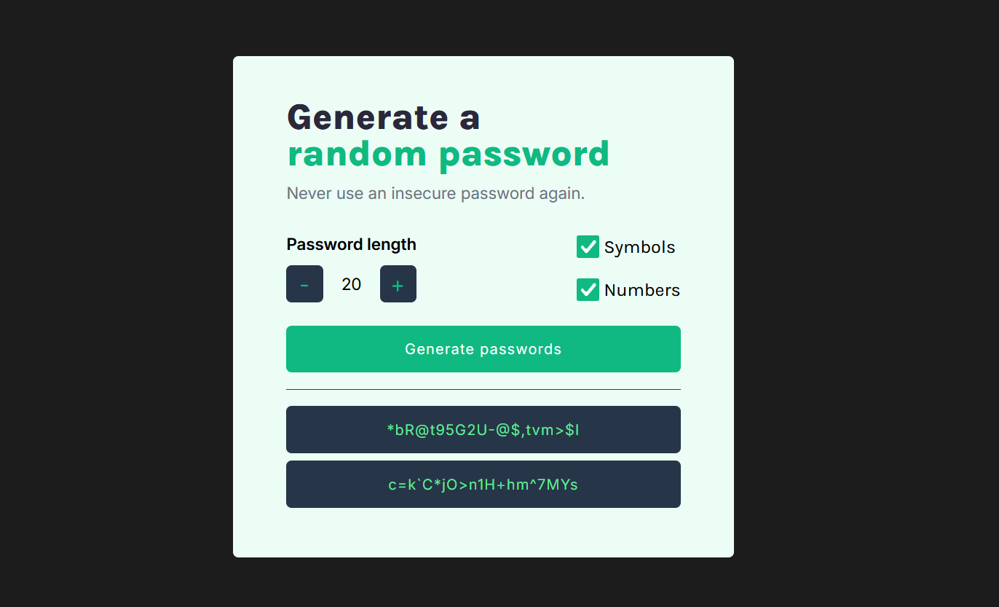

# Password Generator

The **Password Generator** is a simple web application that allows users to generate secure, random passwords. Users can customize the password length and choose whether to include numbers and symbols.

## Features

- **Adjustable Password Length**: Users can increase or decrease the length of the generated password.
- **Include Symbols and Numbers**: Users can toggle the inclusion of special characters and numbers in the password.
- **Copy Passwords**: Easily copy generated passwords to the clipboard with a single click.

## How to Use

1. Open the application in a web browser.
2. Adjust the desired password length using the `+` and `-` buttons.
3. Select whether to include symbols and numbers in the password.
4. Click the **"Generate passwords"** button to generate random passwords.
5. Click on a generated password to copy it to the clipboard.

## Desktop View

